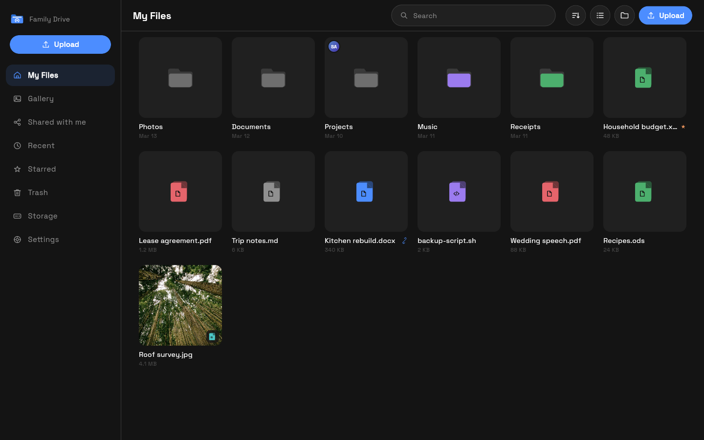

<div align="center">


# Local Drive

**Your own file server, on your own hardware.**

[](LICENSE)
[](server/go.mod)
[](localdrive/pubspec.yaml)

[Documentation](docs/introduction.mdx) ·
[Server](server/) ·
[App](localdrive/) ·
[Website](landing/)

</div>

---

**Linux**

```
wget https://github.com/MultiX0/LocalDrive/releases/latest/download/server
chmod +x server
./server
```

**Windows**, in PowerShell

```
Invoke-WebRequest https://github.com/MultiX0/LocalDrive/releases/latest/download/server.exe -OutFile server.exe
.\server.exe
```

That is the whole install. One file, no runtime, nothing to configure first. It
asks a few questions, generates its own secrets, and starts. Setup then offers
to put it on your PATH, and after that you type `localdrive` from anywhere.

On a Raspberry Pi or an ARM server, use `server-arm64` in place of `server`.

---

Local Drive is a private alternative to Google Drive that runs on a computer you
own. Your files stay on your machine. There is no account to make with anyone,
no subscription, and no company in the middle.

**The server is the product. The apps are just windows onto it.**

Everything lives in the server: your files, the accounts, the permissions, the
versions, the sharing. Every rule is decided there and enforced there, on every
request. That is the piece you install, the piece you back up, and the piece
that is actually yours.

The phone, desktop and browser apps hold nothing of their own. They ask the
server what exists and show it. Uninstall every one of them and you have lost
nothing, because none of them were ever where your files were. Point a fresh
one at the same address and everything is back. You can also skip them
entirely and use a browser.

---

## Run it in three steps

### 1. Download the server

The command at the top does this. To do it by hand instead, take `server` for
Linux or `server.exe` for Windows from
[the latest release](https://github.com/MultiX0/LocalDrive/releases/latest).

There is no published macOS build yet. The server does run on macOS, so on a
Mac build it from source with `cd server && go build ./cmd/localdrive`.

### 2. Start it

On Linux, a fresh download is not executable yet, so allow it to run first:

```
chmod +x ./server
./server
```

On Windows, run `server.exe` or double-click it.

That is the whole command. There is nothing to configure first. It asks a few
questions, generates every secret it needs, and starts. You never have to
invent a password for anything internal.

During setup it offers to put itself on your PATH, so that afterwards
`localdrive` works from any directory. If you skip that, run
`./server install-path` later.

To keep it running after a reboot, see
[Keeping it running](docs/self-hosting/running-always.mdx): systemd on Linux,
Task Scheduler on Windows.

### 3. Open it

Go to `http://localhost:7443` in your browser.

The first screen asks you to make an admin account. That is you. Done.

Plain HTTP is the default, because no certificate authority will issue a
certificate for an address on your own network. If you have a domain pointing
at the machine, set `LD_DOMAIN` in `.env` and it gets a real certificate on its
own, Docker or not. That needs ports 80 and 443 open, since those are the only
two Let's Encrypt will connect back on. See
[HTTP and HTTPS](docs/self-hosting/https.mdx).

---

## Use it from your phone

1. On the computer running the server, find its address on your network. On
   Windows run `ipconfig`, on macOS or Linux run `ifconfig`. Look for something
   like `192.168.1.10`.
2. Install the Local Drive app on your phone.
3. The app scans your network and should find the server on its own. Tap it.
   If it does not appear, type the address, for example `192.168.1.10`.
4. Sign in with the account you just made.

---

## Everyday commands

```
localdrive          set everything up, asking a few questions
localdrive serve    run it in this terminal
localdrive status   where it is, and whether it is running
localdrive logs     follow the log
localdrive backup   copy your files and database somewhere safe
localdrive update   check for a new release and install it
```

Every command is in the [CLI reference](docs/self-hosting/cli.mdx). It runs on
Windows, macOS, and Linux.

---

## Do you need Docker?

**Probably not, and the binary is the better default.** One process instead of
three, a start measured in milliseconds, and a memory footprint in the tens of
megabytes. On an old laptop or a Raspberry Pi with 1 GB of RAM that matters:
the Docker daemon by itself costs more than this entire server does.

A `docker-compose.yml` ships in `server/` and is worth using when you want one
of three specific things, all of which are separate services the bare binary
cannot provide:

- **The browser client.** Caddy serves it. The bare binary answers the API and
  nothing else, so use one of the apps with it, or run Docker.
- Drive management from inside the app, which is Linux only
- Network discovery, so phones find the server without typing an address

HTTPS is no longer one of them. Set `LD_DOMAIN` and the binary requests and
renews its own certificate, with nothing in front of it.

```
cd server
docker compose up -d
```

See [Running without Docker](docs/getting-started/without-docker.mdx) for
exactly what each option costs you.

---

## Add other people

Local Drive does not let strangers sign up. To give someone an account:

1. Open **Settings**, then **Users**.
2. Tap **Invite someone** and give the invite a name, like "Mom".
3. Send them the code, the link, or the QR code however you normally talk.
4. They enter it on their own device and pick their own username and password.
   You never see or handle either.

Each person gets their own private space. Being an admin means you manage
accounts, storage, and settings. It does **not** mean you can read anyone
else's files.

---

## What it does

- **Files, folders, versions, and a trash** that holds things for 30 days.
- **Share a link** with anyone, with an optional password, an optional expiry,
  and view only or download. Change any of that later without the link
  changing.
- **Share with someone on your server** by tapping their face. No usernames to
  type. They keep access on every device they own.
- **Plug in a USB drive** and tap "Use this drive". Eject it safely from the
  app when you are done, or combine several drives into one big one.
- **Uploads survive a dropped connection.** They continue from the exact byte
  they stopped at, not from the beginning.
- **English and Arabic**, each with its own typeface and full right to left
  layout.

---

## Something not working?

| Problem | Answer |
| --- | --- |
| Browser says "Not secure" | Expected with no domain name. It is plain HTTP on your own network, not a broken certificate. See [HTTP and HTTPS](docs/self-hosting/https.mdx). |
| The app cannot find the server | Type the address instead. Both devices need to be on the same network. |
| The app says the server is unreachable | Check you did not type `https://`. With no domain it serves HTTP, and an HTTPS request fails during the handshake. |
| Forgot the admin password | Run `localdrive reset-admin` |
| A USB drive does not show up | Drive management needs Linux. On Windows or macOS, plug it in, then point Local Drive at the folder. |

More in [Troubleshooting](docs/self-hosting/troubleshooting.mdx), every command in
the [CLI reference](docs/self-hosting/cli.mdx), and every setting in
[Environment variables](docs/self-hosting/environment-variables.mdx).

---

## What it looks like

The files browser on desktop. Folders and files carry their own type colour,
and the badges say what is shared, starred, or kept on this device.



Every photo in one timeline, grouped by month and ordered by when it was taken
rather than when it was uploaded. The grid is masonry, so a panorama stays a
panorama instead of being cropped to a square.


These are screenshots of the running app, not mockups.

---

## For developers

| Folder | What it is |
| --- | --- |
| [`server/`](server/) | The Go backend. One binary, several modes. This is the product. |
| [`localdrive/`](localdrive/) | The Flutter app. One codebase, every platform. |
| [`docs/`](docs/) | The full documentation, rendered by the site. |
| [`landing/`](landing/) | The website, which reads `docs/` directly. |
| [`e2e/`](e2e/) | End-to-end tests, run on TestSprite against a deployment. |

```
cd server     && go test ./... && go vet ./...
cd localdrive && flutter analyze && flutter test
cd landing    && npm run build
```

Start with [Architecture overview](docs/architecture/overview.mdx) and
[Development setup](docs/contributing/development-setup.mdx).

Those three commands are the whole local loop and need no account anywhere.

---

## Testing with TestSprite

<p>
  <picture>
    <source media="(prefers-color-scheme: dark)" srcset="docs/assets/testsprite-mark-dark.svg">
    
  </picture>
  Local Drive is tested with <a href="https://www.testsprite.com/">TestSprite</a>,
  the recommended workflow for the layer above unit and integration tests: a real
  browser driven against a running server, checking the workflows a person
  actually performs.
</p>

<br clear="left">

Unit tests prove the pieces. They cannot tell you that a screen sits empty
because the client is calling a route the server does not serve, because from
inside the code nothing is wrong. That is the gap this layer covers, and it
found exactly that bug in this repository.

```
npm install -g @testsprite/testsprite-cli
testsprite setup
testsprite test run --all --project "$TESTSPRITE_PROJECT_ID" --wait
```

The suite is in [`e2e/testsprite/`](e2e/testsprite/): ten workflows written as
sentences, and five checks on the API contract.

<a href="https://github.com/TestSprite/testsprite-cli">
  
</a>

<p>
  <a href="https://www.npmjs.com/package/@testsprite/testsprite-cli"></a>
  <a href="https://github.com/TestSprite/testsprite-cli/blob/main/LICENSE"></a>
  <a href="https://docs.testsprite.com/cli/"></a>
</p>

**Recommended, never required.** TestSprite is a development dependency. The
server does not call it, CI does not run it, and no key is needed to clone,
build, test or send a pull request. The three commands above this section remain
the whole contribution loop.

[Testing with TestSprite](docs/contributing/testsprite.mdx) has the rest,
including authentication, reading a failure, the AI agent workflow, and why the
CLI cannot point at `localhost`. TestSprite's own documentation is at
[docs.testsprite.com](https://docs.testsprite.com/).

| | |
| --- | --- |
| [Vision](VISION.md) | Why the project exists, what it refuses to become, and how to judge whether a change belongs. |
| [Contributing](CONTRIBUTING.md) | How to get it running and what makes a change easy to accept. |
| [Testing](docs/contributing/testing.mdx) | The layers, what belongs in each, and what must not break. |
| [TestSprite](docs/contributing/testsprite.mdx) | The end-to-end layer: installing the CLI, running the suite, and reading a failure. |
| [Security review](docs/contributing/security-review.mdx) | What to check before merging, and the concerns currently open. |
| [Code of conduct](CODE_OF_CONDUCT.md) | Be decent to people. |
| [Security policy](SECURITY.md) | How to report a vulnerability privately, and what is in scope. |
| [Disclaimer](DISCLAIMER.md) | What this is and is not built for. Worth reading before you trust it with anything. |
| [Notes for coding agents](AGENTS.md) | Context for an AI assistant working in this repository. |

---

## License

MIT. See [LICENSE](LICENSE).
